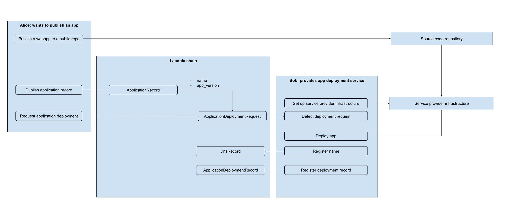

# How to Publish a Webapp

This page outlines the workflow for publishing a webapp through a Laconic chain. 

At a high level, the steps are:
1. Publish a webapp to a public repo.
2. [On-chain] Register an Application Record.
3. [On-chain] Register an Application Deployment Request.
4. Set up Service Provider infrastructure.
5. Deploy the app using the data from the deployment request.
6. [On-chain] Register a DNS Record.
7. [On-chain] Register an Application Deployment Record.

> A bond is required to register a record. Follow [this guide](./create-bond.md) to create a bond if you need one.

[](./publish-webapp-workflow.svg)

## Prerequisites

* Deploy the `laconicd` and `laconic-registry-cli` containers using the script in the [How to Join](/devnet/README.md#how-to-join) section of the README.
* Configure the `laconic-registry-cli` container with a private key.

## Set up Service Provider Infrastructure

A Service Provider must be running infrastructure and software that is able to detect new Application Deployment Requests and deploy applications as requested.

## Register an Application Record

Anybody looking to publish an app must register an Application Record that Application Deployment Requests can reference.
  
* Copy [`application-record.yml`](application-record.yml) to `laconic-console-deployment/data/laconic-registry-data/application-record.yml`
* Register the Application record using `laconic-registry-cli`:
```
laconic-so deployment --dir laconic-console-deployment exec cli "laconic registry record publish --filename /laconic-registry-data/application-record.yml --bond-id <bond_id> --gas 250000"
{
  "id": "bafyreibmqxncmt4fuwgtf5jzx2k6zkw2iwxaags7z6wgksuqbnusmrpk24"
}
```

## Register an Application Deployment Request

An Application Deployment Request must be registered to notify Service Providers that an app is waiting to be deployed.

* Copy [`application-request.yml`](application-request.yml) to `laconic-console-deployment/data/laconic-registry-data/application-request.yml`
* Register the Application record using `laconic-registry-cli`:
```
laconic-so deployment --dir laconic-console-deployment exec cli "laconic registry record publish --filename /laconic-registry-data/application-request.yml --bond-id <bond_id> --gas 250000"
{
  "id": "bafyreia4skpopfqre3j4romwmbtydgb5d53e2g2pvfd4kedjr7kwtrcb7u"
}
```

## Register a DNS Record

A Service Provider must register a DNS Record after a successful application deployment.

* Copy [`dns-record.yml`](dns-record.yml) to `laconic-console-deployment/data/laconic-registry-data/dns-record.yml`
* Register the DNS record using `laconic-registry-cli`:
```
laconic-so deployment --dir laconic-console-deployment exec cli "laconic registry record publish --filename /laconic-registry-data/dns-record.yml --bond-id <bond_id> --gas 250000"
{
  "id": "bafyreie2yesktfv2jez5fyvtc2thklpg5suh6ygdy6ggijbeckmohohybm"
}
```

The DNS record is now on-chain. It can be verified using the console or with laconicd:
```
laconic-so deployment --dir fixturenet-laconicd-deployment exec laconicd "laconicd q registry get bafyreie2yesktfv2jez5fyvtc2thklpg5suh6ygdy6ggijbeckmohohybm -o json | jq -r '.record.attributes'" | base64 --decode | jq '.name'
"laconic-app.hypha.coop"
```

## Register an Application Deployment Record

A Service Provider must register an Application Deployment Record after a successful deployment.

* Copy [`application-deployment.yml`](application-deployment.yml) to `laconic-console-deployment/data/laconic-registry-data/application-deployment.yml`
* Register the DNS record using `laconic-registry-cli`:
```
laconic-so deployment --dir laconic-console-deployment exec cli "laconic registry record publish --filename /laconic-registry-data/application-deployment.yml --bond-id <bond_id> --gas 250000"
{
  "id": "bafyreieow4oybr5spo6imwtegd24t26obqhlnq5tl2mw3cvpbdq4prst7e"
}
```

The Application Deployment Record is now on-chain. It can be verified using the console or with laconicd:
```
laconic-so deployment --dir fixturenet-laconicd-deployment exec laconicd "laconicd q registry get bafyreieow4oybr5spo6imwtegd24t26obqhlnq5tl2mw3cvpbdq4prst7e -o json | jq -r '.record.attributes'" | base64 --decode | jq '.name'
"hypha-demo-app"
```
