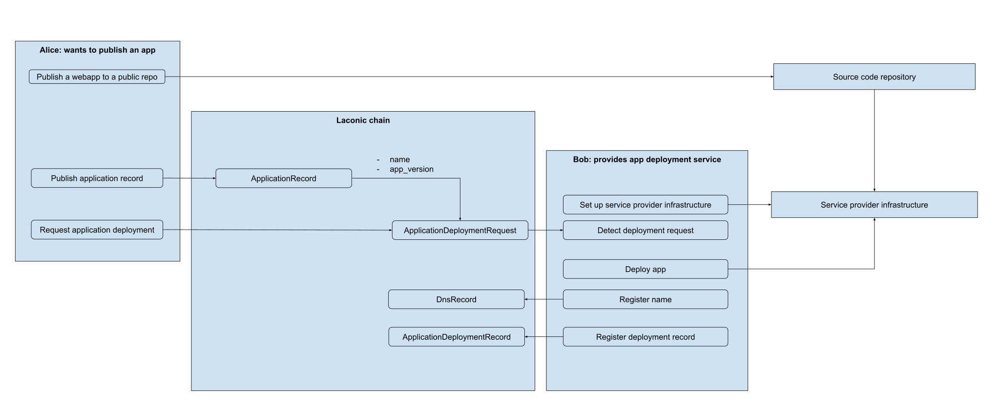

# How to Publish a Webapp

This page outlines the workflow for publishing a webapp through a Laconic chain. 

At a high level, the steps are:
1. Set up Service Provider infrastructure.
2. [On-chain] Create a bond to register a DNS Record.
3. [On-chain] Register a DNS Record.
4. Publish a webapp to a public repo.
5. [On-chain] Create a bond to register an Application Record.
6. [On-chain] Register an Application Record.
7. [On-chain] Create a bond to register an Application Deployment Request.
8. [On-chain] Register an Application Deployment Request.
9. Deploy the app using the data from the deployment request.
10. [On-chain] Create a bond to register an Application Deployment Record.
11. [On-chain] Register an Application Deployment Record.



## Prerequisites

* Deploy the `laconicd` and `laconic-registry-cli` containers using the script in the [How to Join](/devnet/README.md#how-to-join) section of the README.
* Configure the `laconic-registry-cli` container with a private key.

## Set up Service Provider Infrastructure

A Service Provider must be running infrastructure and software that is able to detect new Application Deployment Requests and deploy applications as requested.

## Create a Bond to Register a DNS Record

* Follow [these steps](create-bond.md) and record the bond id.
  * We will call this the `dns_record_bond_id` for the remainder of the guide: `a742489e5817ef274187611dadb0e4284a49c087608b545ab6bd990905fb61f3`
 
## Register a DNS Record

A Service Provider must register a DNS record that app publishers can discover and reference in Application Deployment Requests.

* Copy [`dns-record.yml`](dns-record.yml) to `laconic-console-deployment/data/laconic-registry-data/dns-record.yml`
* Register the DNS record using `laconic-registry-cli`:
```
laconic-so deployment --dir laconic-console-deployment exec cli "laconic registry record publish --filename /laconic-registry-data/dns-record.yml --bond-id <dns_record_bond_id> --gas 250000"
{
  "id": "bafyreie2yesktfv2jez5fyvtc2thklpg5suh6ygdy6ggijbeckmohohybm"
}
```

The DNS record is now on-chain. It can be verified using the console or with laconicd:
```
laconic-so deployment --dir fixturenet-laconicd-deployment exec laconicd "laconicd q registry get bafyreie2yesktfv2jez5fyvtc2thklpg5suh6ygdy6ggijbeckmohohybm -o json | jq -r '.record.attributes'" | base64 --decode | jq '.name'
"laconic-app.hypha.coop"
```

## Create a Bond to Register an Application Record

* Follow [these steps](create-bond.md) and record the bond id.
  * We will call this the `app_record_bond_id` for the remainder of the guide: `47d643bf5796a6b95d6e938923c0cdbcf7360ee0b47fb4b26372c05dfd3307e0`

## Register an Application Record

Anybody looking to publish an app must register an Application Record that Application Deployment Requests can reference.

* Copy [`application-record.yml`](application-record.yml) to `laconic-console-deployment/data/laconic-registry-data/application-record.yml`
* Register the Application record using `laconic-registry-cli`:
```
laconic-so deployment --dir laconic-console-deployment exec cli "laconic registry record publish --filename /laconic-registry-data/application-record.yml --bond-id <app_record_bond_id> --gas 250000"
{
  "id": "bafyreibmqxncmt4fuwgtf5jzx2k6zkw2iwxaags7z6wgksuqbnusmrpk24"
}
```

## Create a Bond to Register an Application Deployment Request

* Follow [these steps](create-bond.md) and record the bond id.
  * We will call this the `app_request_bond_id` for the remainder of the guide: `afb138e431e9897531be641202bb2a1a40b28bb1ff565b1e2acb4659307cd95c`

## Register an Application Deployment Request

An Application Deployment Request must be registered to notify Service Providers that an app is waiting to be deployed.

* Copy [`application-request.yml`](application-request.yml) to `laconic-console-deployment/data/laconic-registry-data/application-request.yml`
* Register the Application record using `laconic-registry-cli`:
```
laconic-so deployment --dir laconic-console-deployment exec cli "laconic registry record publish --filename /laconic-registry-data/application-request.yml --bond-id <app_request_bond_id> --gas 250000"
{
  "id": "bafyreia4skpopfqre3j4romwmbtydgb5d53e2g2pvfd4kedjr7kwtrcb7u"
}
```